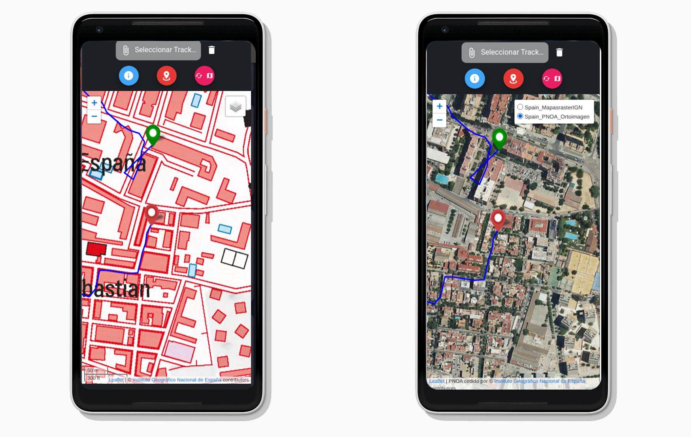

# emarifer-mygps / Mi GPS

------------

***Device screenshot:***



## <i>Progressive Web Application</i> (PWA) developed with VueJS to tracking .gpx routes.

## Deployment in production

#### Installing dependencies:

```
    npm i
```

#### Compiling for VueJs:


```  
    npm run build

    // 1. Vue CLI must be installed.
```

### Once this is done we will deploy the application. For this purpose, a statics file server can be used.

### In some servers it may be necessary to create a <i>404.html</i> with the same content as the <i>index.html</i> so that it does not give us an error when doing a fallback in the browser. This <i>404.html</i> file is created automatically when compiling the application.